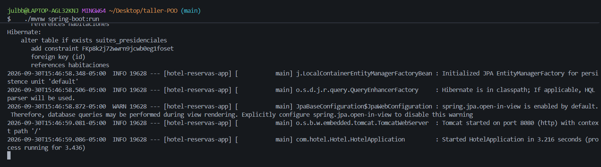
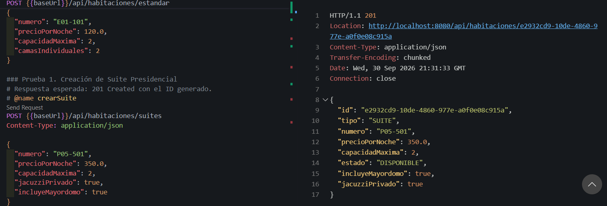
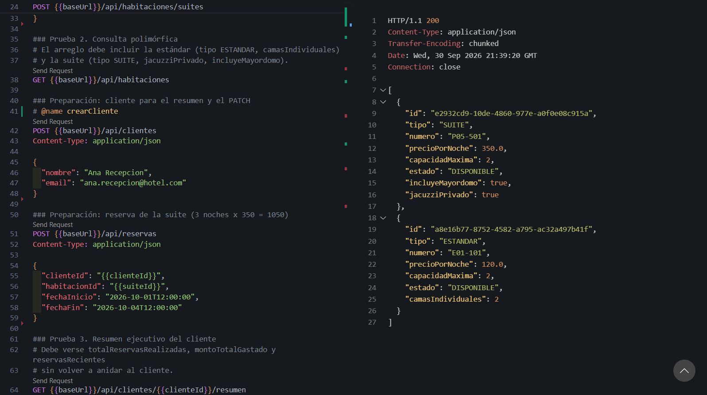
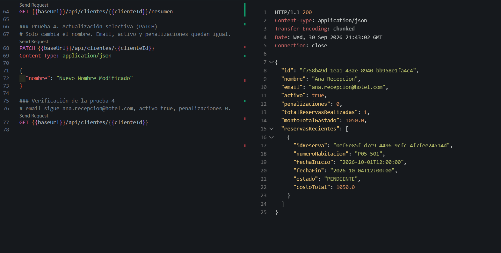
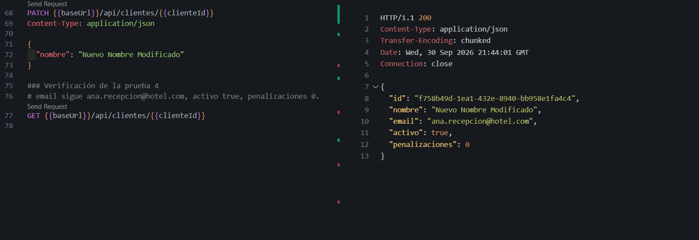
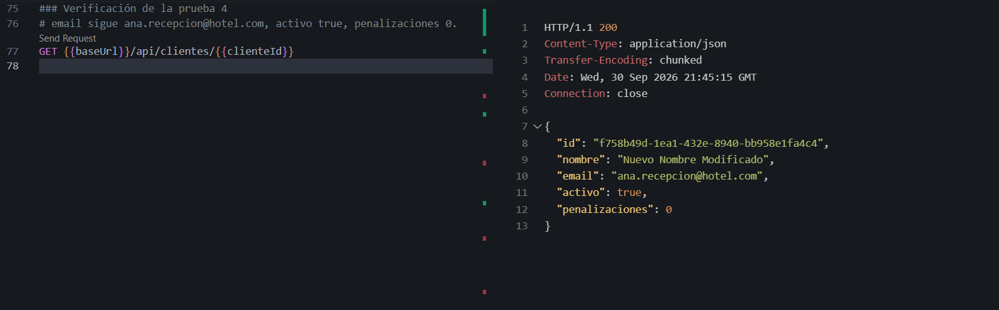

# Taller 7 – API del Hotel

**Estudiante:** Julio Bolaños
**Curso:** Programación Orientada a Objetos
**Docente:** Daniel Fernando Arteaga 

## Tecnologías

Spring Boot 3.3.4 · Java 17 · Spring Data JPA · PostgreSQL · MapStruct 1.5.5

## Cómo ejecutar

1. Crear la base de datos `hotel_reservas_db` en PostgreSQL (usuario y contraseña en `src/main/resources/application.properties`).
2. Iniciar la aplicación:

   ```bash
   ./mvnw clean spring-boot:run
   ```

3. Ejecutar en orden las peticiones de [`solicitudes-avanzadas.http`](solicitudes-avanzadas.http). Los IDs se toman solos de las respuestas anteriores.

## Endpoints implementados

| Método | Ruta | Respuesta |
|---|---|---|
| POST | `/api/habitaciones/estandar` | 201 Created |
| POST | `/api/habitaciones/suites` | 201 Created |
| GET | `/api/habitaciones` | 200 OK (lista polimórfica) |
| GET | `/api/habitaciones/{id}` | 200 OK |
| GET | `/api/clientes/{id}/resumen` | 200 OK |
| PATCH | `/api/clientes/{id}` | 200 OK |

## Solución por tarea

### Tarea 1: Polimorfismo en la API REST

- `HabitacionResponse` es una interfaz sellada implementada por los records `HabitacionEstandarResponse` y `SuitePresidencialResponse`. Cada respuesta lleva el campo `tipo` (`ESTANDAR` o `SUITE`), que MapStruct llena como constante y Jackson usa como discriminador con `@JsonTypeInfo` y `@JsonSubTypes`.
- `HabitacionMapper.toResponse(Habitacion)` obtiene la entidad real con `Hibernate.unproxy`, revisa su subclase en tiempo de ejecución y delega en el método de MapStruct de ese tipo. Así la respuesta conserva los atributos propios de cada habitación.
- Un solo `HabitacionController` atiende los dos tipos: el tipo que se crea lo define la ruta del POST.

### Tarea 2: Resumen del cliente con proyecciones anidadas

- `ClienteResumenResponse` incluye la lista `reservasRecientes` de `ReservaItemResponse`. Ese sub-DTO no vuelve a referenciar al cliente, así que no hay recursión infinita al serializar.
- En `ClienteMapper`, dos métodos `@Named` calculan `totalReservasRealizadas` (con `getReservas().size()`) y `montoTotalGastado` (con un Java Stream y `mapToDouble`).
- `ClienteRepository.findWithReservasById` trae el cliente con sus reservas y habitaciones en una sola consulta (`join fetch`).

### Tarea 3: Actualización parcial con PATCH

- `updateClienteFromDto` usa `@MappingTarget` con `NullValuePropertyMappingStrategy.IGNORE`: los campos que llegan en `null` no se modifican.
- Se ignoran explícitamente `id`, `activo`, `penalizaciones` y `reservas` para evitar la sobre-asignación (Mass Assignment).
- `Cliente` solo expone `setNombre` y `setEmail`, con la misma validación del constructor. `activo` y `penalizaciones` siguen protegidos por las reglas de negocio.

## Evidencias

### Aplicación en ejecución



### Prueba 1: Creación de Suite Presidencial

`POST /api/habitaciones/suites` → **201 Created** con el ID generado y `"tipo": "SUITE"`.



### Prueba 2: Consulta polimórfica

`GET /api/habitaciones` → **200 OK**. En el mismo array aparecen la habitación estándar (`"tipo": "ESTANDAR"`, con `camasIndividuales`) y la suite (`"tipo": "SUITE"`, con `incluyeMayordomo` y `jacuzziPrivado`).



### Prueba 3: Resumen ejecutivo del cliente

`GET /api/clientes/{id}/resumen` → **200 OK** con `totalReservasRealizadas: 1`, `montoTotalGastado: 1050.0` y la lista `reservasRecientes` embebida, sin ciclos.



### Prueba 4: Actualización selectiva (PATCH)

`PATCH /api/clientes/{id}` enviando solo `{ "nombre": "Nuevo Nombre Modificado" }` → **200 OK**.



Verificación con `GET /api/clientes/{id}`: el email sigue siendo `ana.recepcion@hotel.com`, `activo` es `true` y `penalizaciones` es `0`.


